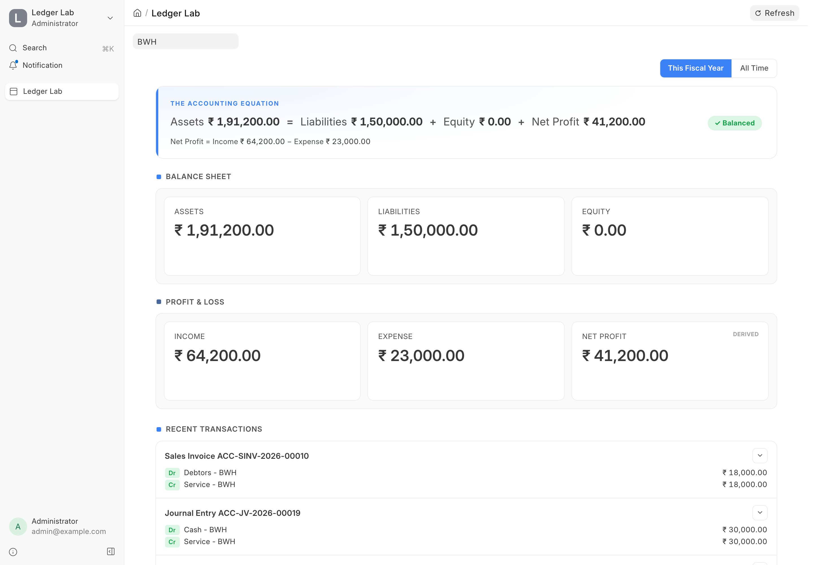
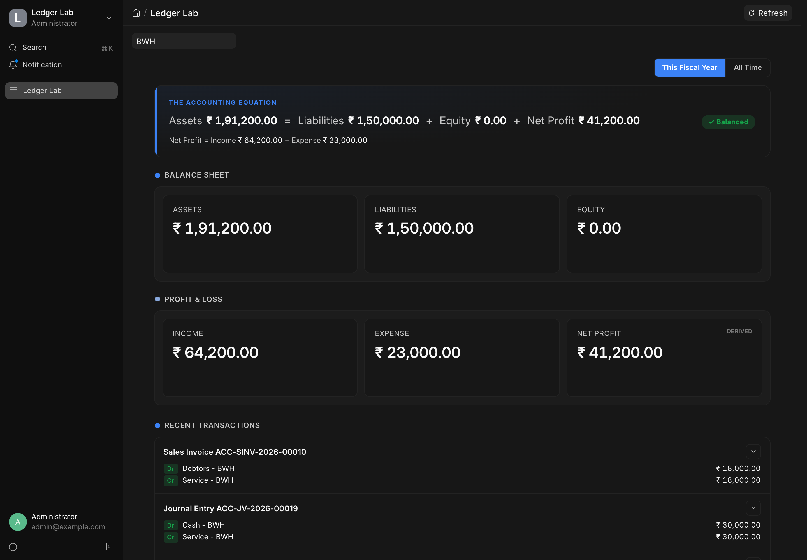
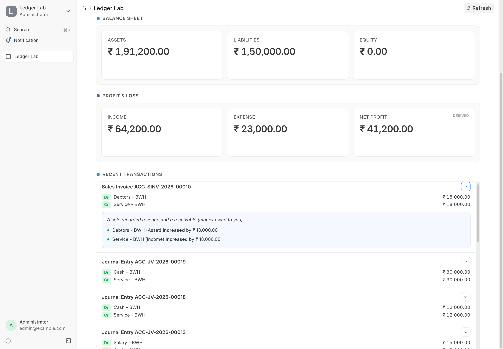
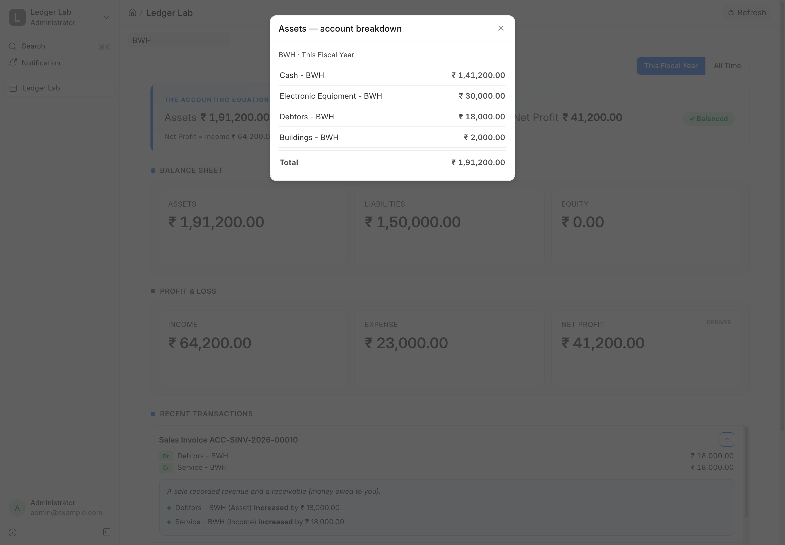

# Ledger Lab

> See how every ERPNext transaction affects your books — **live**.

Ledger Lab is a teaching dashboard for ERPNext. Open it on one screen, then submit
an invoice, payment, or journal entry anywhere in ERPNext. The numbers on the
dashboard update **instantly** — no refresh — so you can watch the accounting
equation stay in balance with every transaction.

It is built for anyone learning double-entry bookkeeping: students, new accountants,
and developers who want to *see* what a voucher actually does to the ledger.

<table>
  <tr>
    <td align="center"><b>Light mode</b></td>
    <td align="center"><b>Dark mode</b></td>
  </tr>
  <tr>
    <td></td>
    <td></td>
  </tr>
</table>

---

## Table of Contents

- [What it does](#what-it-does)
- [Features](#features)
- [Screenshots](#screenshots)
  - [Plain-English explanations](#plain-english-explanations)
  - [Account drill-down](#account-drill-down)
- [How it works](#how-it-works)
- [Installation](#installation)
- [Using the dashboard](#using-the-dashboard)
- [Project layout](#project-layout)
- [Contributing](#contributing)
- [CI](#ci)
- [License](#license)

---

## What it does

Every business transaction has two sides. When you sell a service, the money you are
owed goes **up** *and* your income goes **up**. Ledger Lab shows both sides as they
happen, grouped into the six totals every accountant cares about:

- **Balance Sheet** — Assets, Liabilities, Equity
- **Profit & Loss** — Income, Expense, and the derived **Net Profit**

At the top sits the **accounting equation**:

```
Assets = Liabilities + Equity + Net Profit
```

If your books are correct, this always balances — and Ledger Lab shows a green
**✓ Balanced** badge to prove it after every single transaction.

---

## Features

- **Live updates** — boxes change the moment a voucher is submitted, powered by
  ERPNext's realtime (socket.io) layer. No page reload needed.
- **The accounting equation, always balanced** — a hero bar at the top shows the
  full equation and a balance check that updates with every transaction.
- **Balance Sheet & P&L at a glance** — six clear totals, grouped the way an
  accountant reads them, with large, easy-to-read numbers.
- **Flash + count-up animation** — boxes flash green when a number goes up and red
  when it goes down, then count up or down to the new value.
- **"Last impact" badges** — each box remembers the most recent transaction that
  moved it (for example `▲ +₹500 · from Journal Entry … · just now`).
- **Recent transactions feed** — every voucher appears as a row with its debit and
  credit lines and a link straight to the document in ERPNext.
- **Plain-English explanations** — expand any feed row to read what the transaction
  did, line by line, in simple words (e.g. *"Cash (Asset) increased by ₹500"*).
- **Handles cancellations** — cancel a voucher and the boxes count back down, badges
  turn red, and the feed shows a muted "Cancelled" reversal row.
- **Company picker** — switch between the companies in your ERPNext site.
- **Time scope** — toggle between **This Fiscal Year** and **All Time**.
- **Account drill-down** — click any Balance Sheet / P&L box to see the individual
  accounts that make up the total. The rows always add up to the box, and each
  account links to ERPNext's General Ledger report.
- **Light & dark mode** — looks great in both, following your ERPNext theme.
- **Accessible** — keyboard-friendly drill-down and full `prefers-reduced-motion`
  support (animations turn off, but the live numbers and explanations still work).

---

## Screenshots

### Plain-English explanations

Expand any transaction in the feed to see exactly what it did to the ledger, written
in simple language.



### Account drill-down

Click a box to break the total down by account. The rows always reconcile to the box,
and each account links to the General Ledger report.



---

## How it works

Ledger Lab is a single ERPNext **Desk Page** (vanilla JavaScript, no build step) plus
a small Python API. The live behaviour follows this path:

```
You submit a voucher in ERPNext
        │
        ▼
GL Entry is created  →  a server hook buffers the lines
        │
        ▼
On commit, one realtime event is published per voucher
        │
        ▼
The dashboard receives it over socket.io and updates the boxes,
the equation, the badges, and the feed — instantly.
```

The first load reads authoritative totals from the API; after that the dashboard
applies each transaction's changes locally so it stays perfectly in sync without
re-querying on every event. The **Refresh** button always re-syncs from the server.

---

## Installation

You can install this app using the [bench](https://github.com/frappe/bench) CLI:

```bash
cd $PATH_TO_YOUR_BENCH
bench get-app $URL_OF_THIS_REPO --branch develop
bench install-app ledger_lab
```

This app needs ERPNext (for the accounting doctypes and the General Ledger report).

---

## Using the dashboard

1. Open **`/app/ledger-lab`** in your ERPNext site.
2. Pick a **company** and a **time scope** (This Fiscal Year or All Time).
3. Submit a transaction elsewhere in ERPNext — a Sales Invoice, Payment Entry, or
   Journal Entry — and watch the boxes update live.
4. **Click a box** to drill into its accounts.
5. **Expand a feed row** to read the plain-English explanation of that transaction.

---

## Project layout

```
ledger_lab/
├── ledger_lab/
│   ├── api/dashboard.py              # balances, recent vouchers, account breakdown
│   ├── realtime/gl_entry.py          # buffers GL lines, publishes one event per voucher
│   ├── hooks.py                      # GL Entry → after_insert → collect_gl_entry
│   └── ledger_lab/page/ledger_lab/   # the Desk Page (.json fixture + .js controller)
└── specs/                            # build specs and progress notes
```

See [`specs/`](specs/) for the design and the phase-by-phase build notes.

---

## Contributing

This app uses `pre-commit` for code formatting and linting. Please
[install pre-commit](https://pre-commit.com/#installation) and enable it for this
repository:

```bash
cd apps/ledger_lab
pre-commit install
```

Pre-commit is configured to use the following tools for checking and formatting your code:

- ruff
- eslint
- prettier
- pyupgrade

## CI

This app uses GitHub Actions for CI. The following workflows are configured:

- **CI**: Installs this app and runs unit tests on every push to the `develop` branch.
- **Linters**: Runs [Frappe Semgrep Rules](https://github.com/frappe/semgrep-rules) and
  [pip-audit](https://pypi.org/project/pip-audit/) on every pull request.

## License

[MIT](license.txt)
